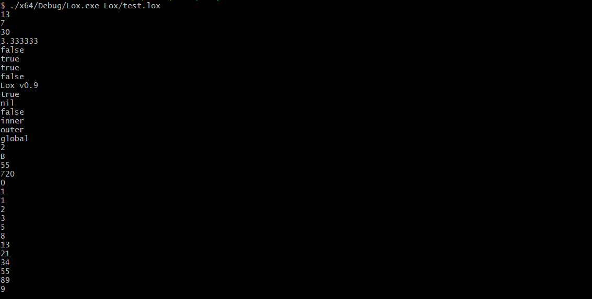
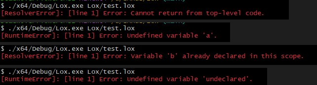

# Lox Interpreter (C++)

A C++ implementation of the Lox programming language from [*Crafting Interpreters*](https://craftinginterpreters.com/) by Bob Nystrom.

## 📚 About

This project is my journey through *Crafting Interpreters*, translating the Java implementation (jlox) to modern C++. It's a learning project focused on understanding interpreter design, lexical analysis, parsing, and language implementation — with several challenge extensions and improvements beyond the book.

---

## ✅ Implementation Progress

### Chapter 4 — Scanning
- Lexical analysis and tokenization
- All Lox token types — single/double character tokens, literals, keywords
- Line number tracking for error reporting
- String and number literal parsing
- Comment support (`//`)

### Chapter 5 — Representing Code
- AST node definitions for all expressions and statements
- `AstPrinter` — Visitor pattern debug tool, prints AST as Lisp-style S-expressions
- Example: `1 + 2 * 3` → `(+ 1.000000 (* 2.000000 3.000000))`

### Chapter 6 — Parsing Expressions
- Recursive descent parser for all Lox expressions
- Correct operator precedence and associativity
- Arithmetic, comparison, equality, unary, grouping, literals

### Chapter 7 — Evaluating Expressions
- Tree-walk interpreter with Visitor pattern
- `stringify()` for clean output — trims trailing zeros, handles `bool` and `nil`
- `isTruthy()` — only `false` and `nil` are falsy
- Runtime error handling with line numbers

### Chapter 8 — Statements and State
- `print` statements and expression statements
- Variable declaration (`var`) and assignment (`=`)
- Block scoping with `{ }` — variables local to their block
- Lexical environment chain — `Environment` class with `enclosing` pointer
- `executeBlock()` with proper scope cleanup on exceptions

### Chapter 9 — Control Flow
- `if` / `else if` / `else`
- `while` loops
- `for` loops — desugared into `while` at parse time, no new AST node needed
- Logical `and` / `or` with short-circuit evaluation
- **Lox is now Turing complete**

### Chapter 10 — Functions
- `fun` keyword for function declarations
- First-class functions — stored in variables, passed as arguments, returned
- `LoxCallable` abstract base class — interface for all callables
- `LoxFunction` runtime object — wraps `FuncStmt` with captured closure environment
- `return` statements via `ReturnException` — cleanly unwinds arbitrarily deep call stacks
- Arity checking before `call()` is invoked
- Native functions — `clock()` injected at startup

### Lambda Functions *(Challenge Extension — Chapter 10)*
- Anonymous function expressions — `fun(x) { return x * x; }`
- Parsed in `parsePrimary()` — lambda is an expression, produces a value
- `LambdaExpr` AST node — params + body, no name
- `LoxLambda` runtime class — inherits `LoxCallable`, identical mechanics to `LoxFunction`
- Immediately invokable: `fun(a, b) { return a + b; }(3, 5)`
- Storable, passable as arguments to higher-order functions

### shared_ptr Environment Refactor
- Replaced all raw `Environment*` with `shared_ptr<Environment>`
- `executeBlock` no longer deletes — `shared_ptr` handles lifetime automatically
- Fixes crash from `delete` on stack-allocated call environments

### Chapter 11 — Resolving and Binding
- **Resolver** — static analysis pass that runs after parsing, before interpretation
- Pre-computes exact scope depth for every variable reference — no runtime chain walking
- Closure bug fixed — variables captured at **definition time**, not call time
- `ResolverError` — compile-time errors caught before any code runs

**Indexed Variable Resolution** *(Challenge Extension — Chapter 11)*
- Each variable assigned a slot index at declaration time
- Environment stores locals in a `vector` instead of `unordered_map`
- Lookup is `getAt(depth, index)` — walk depth hops, then `values[index]` — pure O(1)
- Globals still use name-based map lookup (correct by design)

**Shadow Warnings & Redeclaration Errors** *(Beyond the book)*
- `[Warning]` in yellow for variable shadowing — local shadows local, local shadows global
- `[ResolverError]` for same-scope and global redeclaration — always a bug
- `FunctionType` enum — tracks whether resolver is inside `NONE`, `FUNCTION`, or `LAMBDA`
- Compile-time error for `return` outside any function or lambda

### Chapter 12 — Classes 
- `class` keyword for class declarations
- Instantiation via call syntax — `ClassName()`
- Fields — get and set properties on instances (`instance.field`, `instance.field = value`)
- Methods — defined inside class body, shared across all instances
- `this` — refers to the current instance inside a method
- **Bound methods** — when a method is accessed via get, it is wrapped with `this` pre-bound to the instance (Python-style bound methods)
- Fields shadow methods — if a field and method share a name, field takes priority
- Functions stored in fields are callable like methods, but `this` is not bound
- `GetExpr` — property access (`instance.field`)
- `SetExpr` — property assignment (`instance.field = value`)
- `ThisExpr` — resolved statically by Resolver at depth 1 (class scope), bound at runtime via `bind()`
- `LoxClass` — runtime class object, holds method map
- `LoxInstance` — runtime instance object, holds fields map, inherits `enable_shared_from_this`
- `bind()` — creates a new closure environment with `this = instance` at slot 0, returns a new `LoxFunction`

---

## 📋 Roadmap

- ⏳ Chapter 13 — Inheritance

---

## 📁 Project Structure

```
Lox/
├── include/
│   ├── core/
│   │   ├── Common.h
│   │   ├── Error.h
│   │   ├── Lox.h
│   │   └── Token.h
│   ├── scanner/
│   │   └── Lexer.h
│   ├── parser/
│   │   ├── ASTPrinter.h
│   │   ├── Expr.h
│   │   ├── Parser.h
│   │   └── Stmt.h
│   └── interpreter/
│       ├── Environment.h
│       ├── Interpreter.h
│       ├── LoxCallable.h
│       ├── LoxInstance.h
│       ├── Resolver.h
│       └── Return.h
├── src/
│   ├── core/
│   │   └── Lox.cpp
│   ├── scanner/
│   │   └── Lexer.cpp
│   ├── parser/
│   │   ├── ASTPrinter.cpp
│   │   ├── Expr.cpp
│   │   ├── Parser.cpp
│   │   └── Stmt.cpp
│   ├── interpreter/
│   │   ├── Environment.cpp
│   │   ├── Interpreter.cpp
│   │   ├── LoxCallable.cpp
│   │   ├── LoxInstance.cpp
│   │   └── Resolver.cpp
│   └── Main.cpp
├── docs/
│   ├── ARCHITECTURE_NOTES.md
│   ├── ASSIGNMENT_PIPELINE.md
│   ├── CLASS_METHODS_PIPELINE.html
│   ├── FILE_STRUCTURE.txt
│   ├── FUNCTION_PIPELINE.md
│   ├── GRAMMAR_NOTATION_REFERENCE.txt
│   ├── INDEXED_RESOLVER.pdf
│   ├── INTERPRETER_PIPELINE.md
│   ├── LOXCALLABLE_PIPELINE.md
│   ├── LOX_PIPELINE.html
│   ├── PARSER_FUNCTIONS_EXPLAINED.txt
│   ├── PARSE_TREE_EXAMPLES.txt
│   ├── PARSE_TREE_PRACTICE_15_EXAMPLES.txt
│   ├── RESOLVER_PIPELINE.pdf
│   ├── TURING_COMPLETENESS.md
│   ├── VISITOR_PATTERN_COMPLETE_FLOW.md
│   ├── Resolver/
│   │   └── LAYMEN.html
│   └── images/
│       ├── repl_output.png
│       ├── test_output.png
│       └── test_output_errors.png
├── test.lox
└── Lox.vcxproj
```

---

## 🎯 Sample Programs

### 1. Closures & Higher-Order Functions
```lox
fun makeAdder(x) {
    return fun(y) { return x + y; };
}

var add5  = makeAdder(5);
var add10 = makeAdder(10);

print add5(3);         // 8
print add10(3);        // 13
print add5(add10(2));  // 17
```

### 2. Closure Counter — Persistent State
```lox
fun makeCounter() {
    var count = 0;
    fun increment() {
        count = count + 1;
        return count;
    }
    return increment;
}

var counter = makeCounter();
print counter();  // 1
print counter();  // 2
print counter();  // 3

var other = makeCounter();
print other();    // 1  — fresh independent state
print counter();  // 4  — original continues
```

### 3. Iterator Pattern — Closures as Objects
```lox
fun range(start, end) {
    var current = start;
    fun next() {
        if (current >= end) return nil;
        var val = current;
        current = current + 1;
        return val;
    }
    return next;
}

var iter = range(0, 5);
print iter();  // 0
print iter();  // 1
print iter();  // 2
print iter();  // 3
print iter();  // 4
print iter();  // nil — exhausted
```

### 4. Fibonacci — Recursion
```lox
fun fib(n) {
    if (n <= 1) return n;
    return fib(n - 1) + fib(n - 2);
}

for (var i = 0; i < 10; i = i + 1) {
    print fib(i);
}
// 0 1 1 2 3 5 8 13 21 34
```

### 5. Scope & Shadow Warnings
```lox
var x = "global";

{
    var x = "outer";  // [Warning] shadows global
    {
        var x = "inner";  // [Warning] shadows outer
        print x;  // inner
    }
    print x;  // outer
}

print x;  // global
```



### 6. Error System
```lox
// Compile-time — return outside function
return "bad";
// [ResolverError]: Cannot return from top-level code.

// Compile-time — self-initialization
var a = a;
// [ResolverError]: Can't read local variable in its own initializer.

// Compile-time — same scope redeclaration
{ var b = 1; var b = 2; }
// [ResolverError]: Variable 'b' already declared in this scope.

// Runtime — undefined variable
print undeclared;
// [RuntimeError]: Undefined variable 'undeclared'.
```



### 7. Classes — Bound Methods & this
```lox
class Counter {
    init() { this.count = 0; }
    increment() { this.count = this.count + 1; }
    value() { return this.count; }
}

var c = Counter();
c.init();
c.increment();
c.increment();
print c.value();  // 2
```

### 8. Classes — Chained Method Calls
```lox
class Builder {
    init() { this.result = ""; }
    add(s) { this.result = this.result + s; return this; }
    build() { return this.result; }
}

var b = Builder();
b.init();
print b.add("Hello").add(" ").add("World").build();  // Hello World
```

---

## 🔧 Building & Running

### Prerequisites
- Visual Studio 2019 or later (C++20)
- Or any C++20 compatible compiler (GCC, Clang)

### Build in Visual Studio
1. Open `Lox.vcxproj`
2. Select **Debug** or **Release**
3. `Ctrl+Shift+B` → output at `x64/Debug/Lox.exe`

### Run a `.lox` file
```bash
./x64/Debug/Lox.exe test.lox
```

### REPL mode
```bash
./x64/Debug/Lox.exe
```

---

## 📖 Key C++ Lessons Learned

| Challenge | Solution |
|---|---|
| Java's `Object` type | `std::variant<double, bool, string, nullptr_t, shared_ptr<LoxCallable>>` |
| Garbage collection | `shared_ptr` for shared ownership, `unique_ptr` for AST nodes |
| Circular dependencies | Forward declarations in headers, full includes in `.cpp` only |
| `bool` in variant | Must explicitly wrap as `LiteralValue(bool)` — C++ prefers `bool → double` |
| `unique_ptr` in collections | `std::move` non-negotiable — copy constructor deleted by design |
| Return across call stack | `ReturnException` — intentional exceptions as control flow |
| Closure lifetime | `shared_ptr<Environment>` — env stays alive as long as any closure references it |
| Stack vs heap allocation | Function call env was stack-allocated, `delete` crashed — `shared_ptr` fixes this |
| Pointer as map key | Raw `const Expr*` — non-owning, address uniquely identifies AST node |
| Uninitialized pointers | Always initialize — raw pointer with no init points at garbage, instant segfault |
| `this` binding | `shared_from_this()` — can't use raw `this` to create a `shared_ptr`, would double-free |
| Method vs field lookup | Fields shadow methods — instance map checked first, class method map second |

---

## 🙏 Acknowledgments

- [Bob Nystrom](https://github.com/munificent) for [*Crafting Interpreters*](https://craftinginterpreters.com/)
- Original Java implementation (jlox) as reference

---