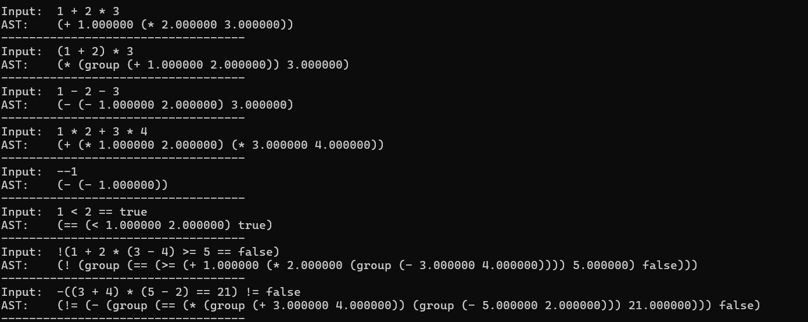

# Lox Interpreter (C++)

A C++ implementation of the Lox programming language from [*Crafting Interpreters*](https://craftinginterpreters.com/) by Bob Nystrom.

## 📚 About

This project is my journey through *Crafting Interpreters*, translating the Java implementation (jlox) to modern C++. It's a learning project focused on understanding interpreter design, lexical analysis, parsing, and language implementation.

## 🚧 Current Status

**Completed:**
- ✅ **Chapter 4: Scanning** — Lexical analysis and tokenization
- ✅ **Chapter 5: Representing Code** — AST node definitions
- ✅ **Chapter 6: Parsing Expressions** — Recursive descent parser with full expression support

**Coming Next:**
- ⏳ Chapter 7: Evaluating Expressions
- ⏳ Chapter 8: Statements and State
- ⏳ And more...

## 📁 Project Structure

```
Lox/
├── include/
│   ├── core/
│   │   ├── Lox.h
│   │   └── Token.h
│   ├── scanner/
│   │   ├── Lexer.h
│   │   └── TokenType.h
│   ├── parser/          (future)
│   │   ├── Parser.h
│   │   ├── Expr.h
│   │   └── Stmt.h
│   └── interpreter/     (future)
│       └── Interpreter.h
├── src/
│   ├── core/
│   │   └── Lox.cpp
│   ├── scanner/
│   │   └── Lexer.cpp
│   ├── parser/          (future)
│   │   └── Parser.cpp
│   ├── interpreter/     (future)
│   │   └── Interpreter.cpp
│   └── main.cpp
├── tests/
│   ├── scanner/
│   │   ├── test_numbers.lox
│   │   └── test_strings.lox
│   ├── parser/          (future)
│   └── interpreter/     (future)
├── docs/
│   └── (reference files)
└── CMakeLists.txt       (or Makefile)
```

## 🎯 Features Implemented

### Lexer/Scanner (Chapter 4)
- Tokenizes Lox source code into tokens
- Recognizes all Lox token types — single/double character tokens, literals, keywords
- Line number tracking for error reporting
- String and number literal parsing
- Comment support (`//`)

### Parser (Chapter 5 & 6)
- Recursive descent parser for all Lox expressions
- Builds a proper **Abstract Syntax Tree (AST)**
- Handles operator precedence and associativity correctly
- Supports:
  - Arithmetic: `+`, `-`, `*`, `/`
  - Comparison: `<`, `<=`, `>`, `>=`, `==`, `!=`
  - Unary: `-`, `!`
  - Grouping: `(` ... `)`
  - Literals: numbers, strings, `true`, `false`, `nil`

### AstPrinter (Chapter 5)
- Implements the **Visitor pattern** on the AST
- Traverses the expression tree and pretty-prints it as a **Lisp-style S-expression**
- Used for debugging and verifying parser correctness
- Example: `1 + 2 * 3` → `(+ 1.000000 (* 2.000000 3.000000))`

## 🖥️ Parser Output (AST)

The parser prints expressions as a Lisp-style S-expression tree.



## 🔧 Building

### Prerequisites
- C++20 compatible compiler (GCC, Clang, or MSVC)
- CMake (recommended) or Visual Studio


### Compilation (Visual Studio)
Open the `.sln` or `.vcxproj` file and build directly.

## 📖 Learning Notes

### Java → C++ Translation Challenges
- `std::variant` for the `Literal` type (requires C++17+)
- Manual memory management vs Java's garbage collection
- Visitor pattern implementation differs significantly
- Proper use of `std::string`, smart pointers, and Proper use of std::string and `std::unique_ptr` for AST nodes — since each node has exactly one parent/owner, unique_ptr is the right fit over shared_ptr

## 🙏 Acknowledgments

- [Bob Nystrom](https://github.com/munificent) for the excellent [*Crafting Interpreters*](https://craftinginterpreters.com/) book
- The original Java implementation (jlox) as reference

## 📝 License

This is a learning project based on *Crafting Interpreters*. The original book and its code are by Bob Nystrom.

---

⭐ Star this repo if you're also learning from *Crafting Interpreters*!