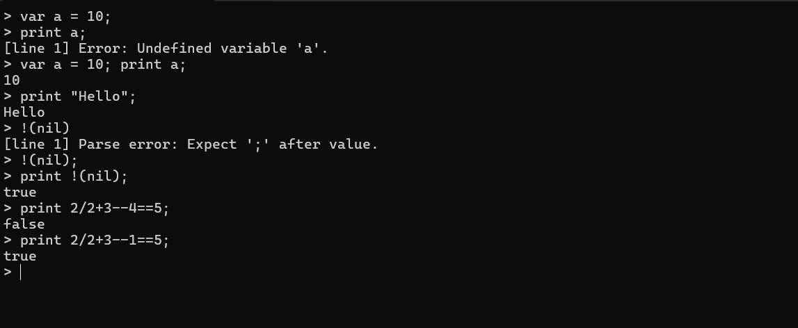

# Lox Interpreter (C++)

A C++ implementation of the Lox programming language from [*Crafting Interpreters*](https://craftinginterpreters.com/) by Bob Nystrom.

## 📚 About

This project is my journey through *Crafting Interpreters*, translating the Java implementation (jlox) to modern C++. It's a learning project focused on understanding interpreter design, lexical analysis, parsing, and language implementation.

## 🚧 Current Status

**Completed:**
- ✅ **Chapter 4: Scanning** — Lexical analysis and tokenization
- ✅ **Chapter 5: Representing Code** — AST node definitions
- ✅ **Chapter 6: Parsing Expressions** — Recursive descent parser with full expression support
- ✅ **Chapter 7: Evaluating Expressions** — Tree-walk interpreter with runtime error handling
- 🔧 **Chapter 8: Statements and State** — Stmt skeleton in place, architectural groundwork done

**Coming Next:**
- ⏳ Chapter 8: Statements and State (in progress)
- ⏳ Chapter 9: Control Flow
- ⏳ And more...

## 📁 Project Structure

```
Lox/
├── include/
│   ├── core/
│   │   ├── Common.h
│   │   ├── Error.h
│   │   ├── Lox.h
│   │   └── Token.h
│   ├── scanner/
│   │   └── Lexer.h
│   ├── parser/
│   │   ├── ASTPrinter.h
│   │   ├── Expr.h
│   │   ├── Parser.h
│   │   └── Stmt.h
│   └── interpreter/
│       └── Interpreter.h
├── src/
│   ├── core/
│   │   └── Lox.cpp
│   ├── scanner/
│   │   └── Lexer.cpp
│   ├── parser/
│   │   ├── ASTPrinter.cpp
│   │   ├── Expr.cpp
│   │   ├── Parser.cpp
│   │   └── Stmt.cpp
│   ├── interpreter/
│   │   └── Interpreter.cpp
│   └── Main.cpp
├── docs/
│   ├── FILE_STRUCTURE.txt
│   ├── GRAMMAR_NOTATION_REFERENCE.txt
│   ├── PARSER_FUNCTIONS_EXPLAINED.txt
│   ├── PARSE_TREE_EXAMPLES.txt
│   ├── PARSE_TREE_PRACTICE_15_EXAMPLES.txt
│   ├── ARCHITECTURE_NOTES.txt
│   └── images/
│       ├── repl_output.png
├── test.lox
└── Lox.vcxproj
```

## 🎯 Features Implemented

### Lexer/Scanner (Chapter 4)
- Tokenizes Lox source code into tokens
- Recognizes all Lox token types — single/double character tokens, literals, keywords
- Line number tracking for error reporting
- String and number literal parsing
- Comment support (`//`)

### Parser (Chapter 5 & 6)
- Recursive descent parser for all Lox expressions
- Builds a proper **Abstract Syntax Tree (AST)**
- Handles operator precedence and associativity correctly
- Supports:
  - Arithmetic: `+`, `-`, `*`, `/`
  - Comparison: `<`, `<=`, `>`, `>=`, `==`, `!=`
  - Unary: `-`, `!`
  - Grouping: `(` ... `)`
  - Literals: numbers, strings, `true`, `false`, `nil`

### Interpreter (Chapter 7)
- Tree-walk interpreter that evaluates AST nodes directly
- Implements the **Visitor pattern** on the expression hierarchy
- Supports full expression evaluation: arithmetic, comparison, equality, unary
- `stringify()` for clean result output — trims trailing zeros from doubles, handles `bool` and `nil`
- Runtime error handling with line number reporting
- `isTruthy()` following Lox semantics — only `false` and `nil` are falsy
- Fix for `bool`-in-variant implicit conversion to `double` (C++ quirk with `std::variant`)

### AstPrinter (Chapter 5)
- Implements the **Visitor pattern** on the AST
- Traverses the expression tree and pretty-prints it as a **Lisp-style S-expression**
- Used for debugging and verifying parser correctness
- Example: `1 + 2 * 3` → `(+ 1.000000 (* 2.000000 3.000000))`

### Lox Driver & REPL (Architectural Refactor)
- `Lox.cpp` drives the full pipeline — REPL mode and file execution via `run()`
- Separate error reporting for compiler errors (lexer/parser) vs runtime errors
- Fixed ***circular dependency*** between `Lox.h` and `Interpreter.h` , `Parser.h` ,`Lexer.h` via proper layering
- `Common.h` and lower layers kept blind to high-level modules — inner layers don't know about outer ones
- Added `core/Error.h` with a proper error hierarchy: `LoxError` → `LexError`, `ParseError`, `RuntimeError`
- Moved includes from headers to implementation files — headers only include what they strictly need
- Fixed string literal storage bug (trailing quote character)

## 🖥️ REPL in Action



## 🖥️ Parser Output (AST)

The parser prints expressions as a Lisp-style S-expression tree.

<!-- Replace the line below with an actual screenshot: -->
<!--  -->

## 🔧 Building

### Prerequisites
- C++20 compatible compiler (GCC, Clang, or MSVC)
- CMake (recommended) or Visual Studio

### Compilation (CMake)
```bash
mkdir build && cd build
cmake ..
make
```

### Compilation (Visual Studio)
Open the `.sln` or `.vcxproj` file and build directly.

## 📖 Learning Notes

### Java → C++ Translation Challenges
- `std::variant` for the `Literal` type (requires C++17+)
- Manual memory management vs Java's garbage collection
- Visitor pattern implementation differs significantly
- Proper use of `std::string` and `std::unique_ptr` for AST nodes — since each node has exactly one parent/owner, `unique_ptr` is the right fit over `shared_ptr`
- `std::variant` with both `bool` and `double` causes implicit conversion issues — C++ prefers converting `bool` to `double`, so comparison results must be explicitly wrapped as `LiteralValue(bool)` to force correct type storage
- **Circular dependency** is a real C++ problem — solved by enforcing strict layer isolation and avoiding high-level includes in low-level headers
- **Header discipline** — only include in headers what is needed for the type declarations; move everything else to the `.cpp` file. Critical at scale

## 🙏 Acknowledgments

- [Bob Nystrom](https://github.com/munificent) for the excellent [*Crafting Interpreters*](https://craftinginterpreters.com/) book
- The original Java implementation (jlox) as reference

## 📝 License

This is a learning project based on *Crafting Interpreters*. The original book and its code are by Bob Nystrom.

---

⭐ Star this repo if you're also learning from *Crafting Interpreters*!